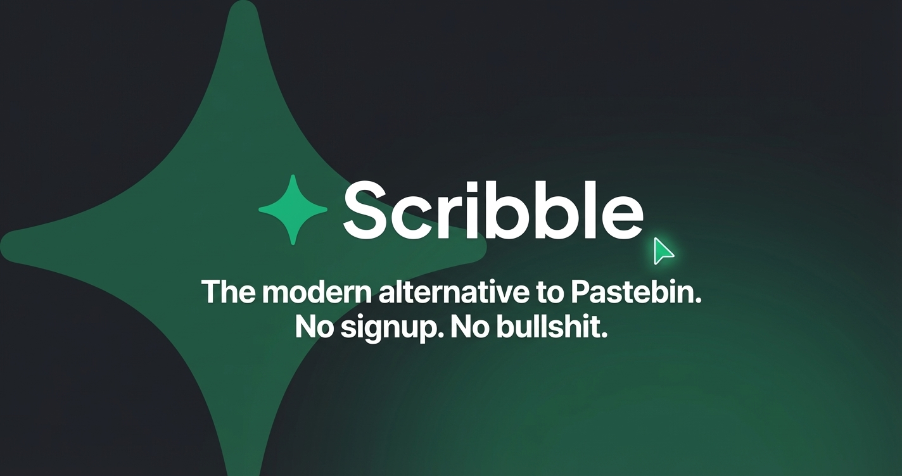
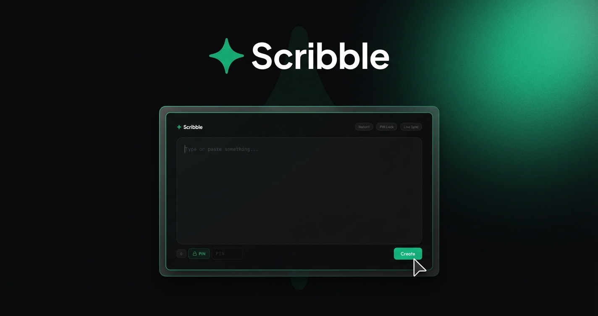

<div align="center">

✦

# Scribble

> A premium, dark-mode first Pastebin alternative — powered by Vercel Serverless and Upstash Redis.

<p align="center">
  
  
  
  
  
  
  
</p>

[](https://modern-pastebin.vercel.app/)

<br />



</div>

---

## 🆕 What's New — v2.0

<table>
<tr><td>🔥</td><td><b>Burn After Reading</b></td><td>Self-destructing pastes that vanish after the first view</td></tr>
<tr><td>⏱️</td><td><b>Custom TTL</b></td><td>Choose expiration: 1 hour, 6 hours, 24 hours, or 7 days</td></tr>
<tr><td>🎨</td><td><b>Syntax Highlighting</b></td><td>20+ languages via highlight.js with auto-detection</td></tr>
<tr><td>📝</td><td><b>Markdown Preview</b></td><td>Full GFM rendering with code blocks, tables, blockquotes</td></tr>
<tr><td>📥</td><td><b>Download</b></td><td>One-click download of paste content as <code>.txt</code></td></tr>
<tr><td>🔢</td><td><b>Line Numbers</b></td><td>Toggleable line numbers in raw and syntax views</td></tr>
<tr><td>🗑️</td><td><b>Admin Delete</b></td><td>Permanently delete your paste from the editor</td></tr>
<tr><td>🔒</td><td><b>Security Hardening</b></td><td>Crypto tokens, timing-safe PIN, XSS protection, input validation</td></tr>
<tr><td>⚡</td><td><b>85% fewer DB calls</b></td><td>Unified Redis Hash storage — from 7 keys to 1 per paste</td></tr>
</table>

---

## 🚀 Overview

**Scribble** is an engineering-centric alternative to traditional pastebins. It features a product-first, terminal-inspired dark mode interface that respects your time. Share code snippets, notes, or configuration files instantly without signing up.

The system is built upon a high-performance **Vercel Serverless** backend, utilizing **Upstash Redis (Vercel KV)** for sub-millisecond data retrieval.

---

## 🏗️ Architecture

```
modern-pastebin/
├── public/                 ← Frontend assets
│   ├── index.html          ← Compose / Editor view
│   ├── view.html           ← Rich Viewer (Raw + Syntax + Markdown)
│   └── style.css           ← Premium Design tokens
├── api/                    ← Serverless Backend
│   ├── create.js           ← POST new pastes (TTL, burn, PIN)
│   ├── content.js          ← GET paste content (single HGETALL)
│   ├── update.js           ← POST paste updates
│   ├── auth.js             ← PIN validation (timing-safe)
│   ├── comment.js          ← POST comments (rate-limited)
│   └── delete.js           ← POST admin delete
└── server.js               ← Local Node.js development server
```

### Data Flow

```
User Browser
     │
     ▼
┌─────────────────────┐
│  Vercel Serverless   │  Node.js API Routes
│  Edge Network        │  UUID-based crypto tokens
└──────────┬───────────┘
           │  1-2 requests per operation
           ▼
┌─────────────────────┐
│  Upstash Redis       │  Single Hash per paste
│  (Vercel KV)         │  Auto-expiry via TTL
└─────────────────────┘
```

---

## ✨ Key Features

### 🎛️ Product-First Design

- **No Landing Page Bloat** — The editor _is_ the homepage. You create pastes immediately.
- **Terminal Aesthetics** — Monospace fonts, deep blacks (`#0a0a0b`), and subtle glassmorphism.
- **Linear/Raycast Inspired** — A strict design system using an emerald accent (`#10b981`), refined easing curves, and logical spacing.
- **Adaptive UI** — The interface morphs seamlessly between creation, success, and editing states without page reloads.

### 🔒 Security & Privacy

| Layer | Protection |
|---|---|
| **Tokens** | `crypto.randomUUID()` — cryptographically secure, unguessable |
| **PIN** | Timing-safe comparison via `crypto.timingSafeEqual` — prevents brute-force timing attacks |
| **XSS** | All user content rendered via `textContent` (DOM API) — zero `innerHTML` on untrusted data |
| **Markdown** | DOM sanitization strips `<script>`, `<iframe>`, `on*` handlers, and `javascript:` URLs |
| **Input** | Server-side validation: 100KB content limit, 4-8 char alphanumeric PIN, 500 char comments, 50 max |
| **Headers** | `X-Content-Type-Options`, `X-Frame-Options: DENY`, `X-XSS-Protection`, `Referrer-Policy` |
| **IDs** | Alphanumeric-only validation prevents Redis key injection |
| **Zero Tracking** | No analytics, no cookies, no data harvesting |

### ⚡ Performance & Optimization

| Metric | Before | After |
|---|---|---|
| KV calls per `create` | 8 (7 SET + 1 GET) | **2** (1 HSET + 1 EXPIRE) |
| KV calls per `content` | 9+ (7 GET + KEYS) | **1** (1 HGETALL) |
| KV calls per `auth` | 4 GET | **1** (1 HGETALL) |
| Editor polling | 2 seconds | **5 seconds** (adaptive: 15s when hidden) |
| Auto-save debounce | 400ms | **800ms** |
| Viewer polling | 10s / 30s idle | 10s / 30s idle |

### 🖥️ Viewer Modes

Switch between three rendering modes instantly:

| Mode | Description |
|---|---|
| **Raw** | Plain text with optional line numbers |
| **Syntax** | highlight.js with 20+ language support and auto-detection |
| **Markdown** | Full GFM rendering (headings, code blocks, tables, blockquotes, images) |

---

## 🛠️ Getting Started

### Local Development

Clone the repository and run the local, in-memory Node server (zero external dependencies required for local testing):

```bash
git clone https://github.com/GlamgarOnDiscord/modern-pastebin.git
cd modern-pastebin

# Start the local server
npm start
```

Visit `http://localhost:3000`.

### Vercel Deployment (Production)

The repository is pre-configured for global edge deployment via Vercel.

1. **Deploy the repository:**

   [](https://vercel.com/new/clone?repository-url=https://github.com/GlamgarOnDiscord/modern-pastebin&env=KV_REST_API_URL,KV_REST_API_TOKEN)

2. **Configure Storage:**
   Once deployed, navigate to your Vercel Dashboard → Storage (or Marketplace) and attach an **Upstash Redis** database to the project. Vercel will automatically inject the required `KV_REST_API_URL` and `KV_REST_API_TOKEN` environment variables.

3. **Enjoy.**

---

## Screenshot



---

## 🤝 Contributing

Pull Requests and ideas are welcome.

1. Fork the repo
2. Create your branch
3. Submit your PR

---

## 📜 License

**MIT License**
Built with ✦ by [GlamgarOnDiscord](https://github.com/GlamgarOnDiscord).
